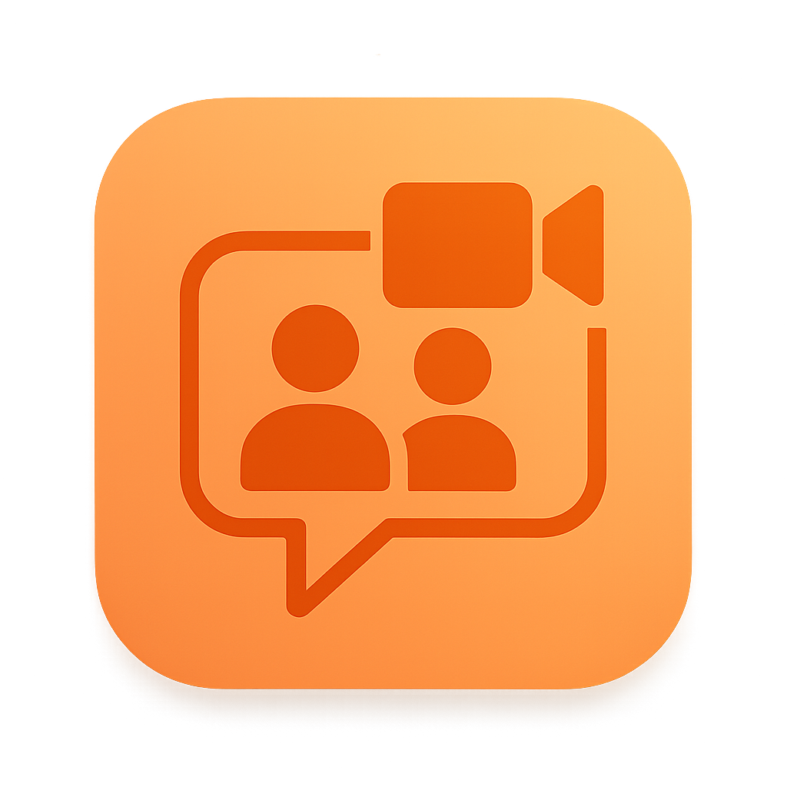

# FittyFiritti

<p align="center">
  
</p>

**Real-time transcription, translation, and presentation editing for bidirectional communication assistance**

🔗 **[https://fittyfiritti.com](https://fittyfiritti.com)**

---

## 🎯 Problem Statement

FittyFiritti solves real-world communication and presentation challenges:

- **🎤 Live Demonstrations**: Keep track of your presentation bullet points as you speak, automatically organizing your thoughts into a structured format
- **🌐 International Meetings**: Bridge language barriers without hiring a human interpreter—your speech is translated in real-time to the other party's language
- **📊 Presentation Tracking**: Never lose track of your talking points during long presentations or lectures
- **💼 Multilingual Collaboration**: Enable seamless communication in meetings where participants speak different languages

**Language Support**: Currently supports English, Spanish, and Japanese. Language support is constrained by the Gemini Nano model's capabilities, with more languages expected in future updates.

---

## ✨ Key Features

### 🎙️ Real-time Transcription
- **Microphone Audio**: Capture and transcribe speech from your microphone in real-time
- **System Audio**: Transcribe system audio through the screen share API
- **Meeting Support**: Use the application during video calls and online meetings to transcribe all participants

### � Intelligent Presentation Editing
- **Automatic Subject Detection**: Detects changes in conversation topics and organizes them automatically
- **Smart Bullet Points**: Automatically adds bullet points to your presentation as you speak
- **Intent Recognition**: Detects when you want to pause or resume the presentation (useful during Q&A sessions)
- **Configurable Analysis**: Choose whether transcriptions from other parties (system audio) should be included in the presentation, or restrict presentation editing to only the main presenter

### 🌐 Translation
- **Bidirectional Translation**: Translates transcriptions and bullet points between languages in real-time
- **Meeting Summary Translation**: Automatically translates the meeting summary to the other party's language

### 💾 Export Capabilities
- **Download Transcriptions**: Export all transcriptions from the meeting
- **Download Translations**: Export translated content
- **Download Presentation**: Export the generated presentation in Markdown format
- **Meeting Summary**: Get an AI-generated summary when the meeting is finished

### 🎯 Main Use Case
Share your screen with the FittyFiritti application during meetings to enable the other party to understand what you're saying and follow your thought process in real-time—eliminating the need for a human interpreter.

---

## � Getting Started - Chrome Setup

Before using FittyFiritti, you need to enable Chrome's Built-in AI features and ensure all required components are up to date.

### Prerequisites
- **Google Chrome 128 or later** (Canary, Dev, or Beta channel recommended for latest AI features)
- Chrome must be configured with experimental AI flags

### Step 1: Enable Chrome AI Flags

1. Open Chrome and navigate to `chrome://flags`
2. Search for and enable the following flags:
   - **Prompt API for Gemini Nano**: `chrome://flags/#prompt-api-for-gemini-nano`
     - Set to: **Enabled Multilingual**
   - **Prompt API for Gemini Nano Multimodal Input**: `chrome://flags/#prompt-api-for-gemini-nano-multimodal-input`
     - Set to: **Enabled Multilingual**
   - **Translation API**: `chrome://flags/#translation-api`
     - Set to: **Enabled**
   - **Summarization API for Gemini Nano**: `chrome://flags/#summarization-api-for-gemini-nano`
     - Set to: **Enabled Multilingual**
   - **Optimization Guide On Device Model**: `chrome://flags/#optimization-guide-on-device-model`
     - Set to: **Enabled BypassPerfRequirement**
3. Click **Relaunch** to restart Chrome with the new settings

### Step 2: Update Chrome Components

1. Navigate to `chrome://components`
2. Find **Optimization Guide On Device Model** in the component list
3. Click **Check for update** to download the latest AI model
4. Wait for all components to update (this may take several minutes)
5. Verify that the **Optimization Guide On Device Model** shows a recent version

### Step 3: Verify AI Availability

1. Open the FittyFiritti application in Chrome
2. If the AI is not ready, you'll see a prompt to download the AI model
3. Click **Download AI Model** and wait for the download to complete
4. Once ready, you'll see the welcome screen with language settings

### Troubleshooting

- **AI Not Available**: Ensure all Chrome flags are enabled and Chrome has been restarted
- **Download Failed**: Check your internet connection and try again
- **Model Not Loading**: Clear Chrome cache and reload the application
- **Components Not Updating**: Close all Chrome windows and restart Chrome completely

For more detailed setup instructions, click the help button (?) in the application's welcome screen.

---

## �🔧 Technical Details


### Voice Activity Detection (VAD)
- Powered by **ONNX Runtime**
- Uses a specialized AI model for accurate speech detection

### Transcription Engine
- **Multi-modal Gemini Nano AI Model** built into Google Chrome
- Uses Chrome's **Prompt API** for audio-to-text transcription
- On-device processing with no external API calls

### Presentation Editor
- **Intention Detection**: Uses the Prompt API to detect when to add bullet points or change subjects
- Intelligent context-aware content organization

### Translation System
- **Translation API**: Chrome's built-in Translation API for bidirectional translation
- Translates transcriptions, bullet points, and subject titles in real-time

### Meeting Summarization
- **Summarizer API**: Chrome's built-in Summarizer API
- Generates concise meeting summaries based on the full transcription

---

## 💡 Value Proposition

### 🔒 Privacy First
- **100% Local Processing**: Everything runs on your computer
- **No Internet Required**: Once loaded, the application works offline
- **No Data Transmission**: Your voice and meeting content never leave your device
- **No Subscriptions**: Completely free to use—no fees to any provider

### 🚀 Powered by Your Hardware
- All AI models execute directly on your device
- No cloud API dependencies
- Fast, responsive, and private

### 🌐 Web-Based
- Runs in your browser—no installation required
- Cross-platform compatibility
- Easy to share and access

---

## 🏗️ Building the Application

### Prerequisites
- Node.js 18+
- PNPM package manager

### Installation

```bash
# Install dependencies
pnpm install
```

### Build

```bash
# Build the application
pnpm run build
```

### Development

```bash
# Run the development server
pnpm dev

# Open http://localhost:5173 in Chrome to see the application
```

---

## 🧪 End-to-End Testing

The project includes comprehensive end-to-end tests using Playwright:

- **Test Audio Files**: Generated test audio files in multiple languages (English, Spanish, Japanese) to validate transcription accuracy
- **Chrome AI Integration**: Playwright configuration includes specific Chrome flags to enable the Prompt API and AI models during test execution
- **Real Transcription Testing**: Tests verify actual transcription functionality using the multi-modal Gemini Nano model
- **Automated Quality Assurance**: Tests ensure the application correctly handles various audio inputs and languages

```bash
# Run end-to-end tests
pnpm test
```

---

## 🏆 About This Project

This application was created for the **Google Chrome Built-in AI Challenge 2025** and is powered by the **Gemini Nano model** and early access APIs from Google Chrome.

### 🤖 AI-Assisted Development

This application has been developed with the assistance of artificial intelligence, specifically **GitHub Copilot**. The development workflow and guidelines for AI agents are documented in the [`AGENTS.MD`](AGENTS.MD) file, which describes the rules and best practices for artificial intelligence agents to collaborate on this project.

---

**Built with ❤️ using Chrome's Built-in AI API (Gemini Nano)**